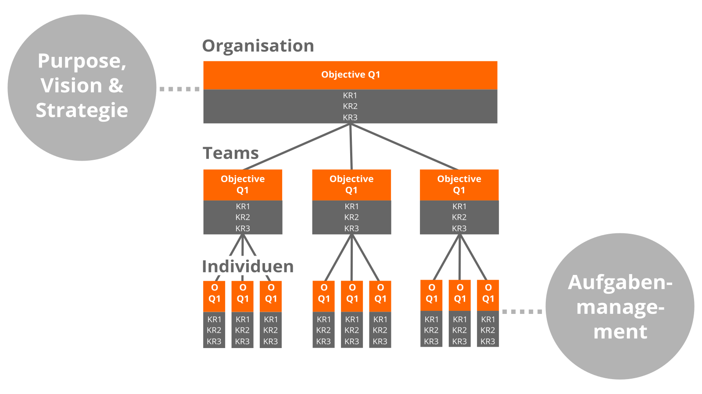

### OKRs auf den Ebenen Individuen, Teams und Organisation (Kata)
In dieser Kata lernst du das Zusammenspiel von OKRs auf den Ebenen Individuum, Team und Organisation kennen.

**Schritt 1:**

Schaue dir das Video [How Google sets goals: OKRs](https://youtu.be/mJB83EZtAjc?t=1061) von Rick Klau an. Dort wird gut beschrieben, dass OKRs nicht nur auf individueller Ebene, sondern auch auf Ebene von Teams, Abteilungen und ganzen Organisationen definiert werden.

Im Gegensatz zu anderen Zielvereinbarungssystemen wie beispielsweise [Management by Objectives](https://de.wikipedia.org/wiki/Management_by_Objectives) (MbO) ist das aber kein reiner Top-Down-Prozess, sondern erfolgt sowohl Top-Down, als auch Bottom-Up. John Doerr empfiehlt:

* **60%** der OKRs top-down
* **40%** der OKRs bottom up

Überlege dir, ob und wie du OKRs neben deiner persönlichen Anwendung auch in deinem Umfeld mit anderen Personen zusammen praktizieren kannst.

**Schritt 1:**

Überlege dir mindestens zwei Maßnahmen, um zu testen, ob dein Umfeld offen für OKRs ist und wie man diese dort umsetzen könnte.